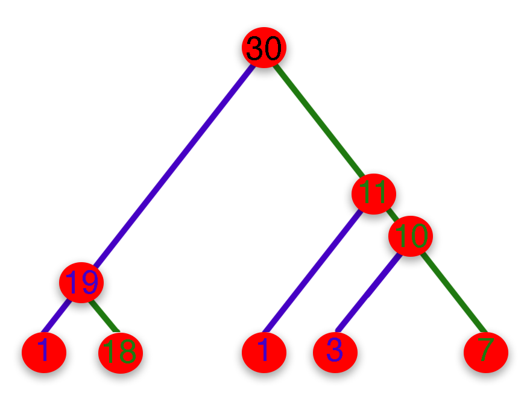

Software for &beta;-Imbalance (BIM): Robust detection of natural selection using a probabilistic model of tree imbalance
====================================================
Our method can use Tree split sizes or Site Frequency Spectrum as a statistic to infer tree imbalance. To use our program, just clone the repository:

```bash
pip install git+https://github.com/jthlab/bim.git
```

In your python session follow the steps.

```python
from bim import bTree, bSFS #our methods
from bim import Colless, Neutrality_Tests #for comparable statistics
import tskit #for handling tree sequences
```

&beta;-Tree
-----------
We will use the tree in the figure. Statistic we have is the split sizes. `n` stores the number of leaves the parent subtends to and `k` stores the number of leaves that left child subtends to. 
In the below, first node subtends 30 leaves (total sample), and its left child subtends 19, `n[i] = 30` and `k[i] = 19`. This figure represents the first
4 splits. Each tree with sample size `N` have `N-1` splits. For this tree at level 5 will experience `25` more splits. So both `n` and `k` are arrays with
size `N-1`.<br>
<br>
Our method accepts 2 different tree types, [Tskit trees](https://tskit.dev/tskit/docs/stable/python-api.html#the-tree-class) and 
[Newick string](https://en.wikipedia.org/wiki/Newick_format).<br>

> The example data files can be found in: [tests/data/test.trees](tests/data/test.trees), [tests/data/testeta.json](tests/data/testeta.json)


* Using Tree-Sequences:

```python
ts = tskit.load('tests/data/test.trees')
N = ts.num_samples
btree = bTree(N = N) # This will initialize the optimizer for a bifurcating tree with 30 nodes
Tree = ts.first() # Get the first tree from the tree-sequence
n, k = btree.tree_to_splits(Tree)['splits'] # Get the bifurcating tree split sizes from tskit.Tree (see the figure)
bt = btree.predict(n, k, w = n-2) # This will return the optimization result
cl = Colless(n, k) # This will return the Colless statistic for the same tree
print('btree:', '{:.3f}'.format(bt.x[0]),'\nColless:', '{:.3f}'.format(cl))
```

```bash
btree: -8.062
Colless: 0.256
```

* Using Newick representation:
```python
nwck = '((12,(9,((23,(10,11)),(((1,((6,(13,(17,18))),((25,(20,21)),(29,30)))),(16,26)),(15,19))))),(5,((24,(3,22)),((14,28),((2,4),(27,(7,8)))))));'
n, k = btree.newick_to_splits(nwck)['splits'] # Get the bifurcating tree split sizes from nwck representation
bt = btree.predict(n, k, w = n-2) # This will return the optimization result
cl = Colless(n, k) # This will return the Colless statistic for the same tree
print('btree:', '{:.3f}'.format(bt.x[0]),'\nColless:', '{:.3f}'.format(cl))
```
```bash
btree: -8.062
Colless: 0.256
```

You can use `split_predict` method to combine split and predict parts. 
```python
btree.split_predict(Tree)
btree.split_predict(nwck)
```

&beta;-SFS
-----------
This method takes [Site Frequency Spectrum](https://en.wikipedia.org/wiki/Allele_frequency_spectrum) as the input. `sfs` is need to be an array 
where `sfs[i] = number of mutation which has i+1 copies in the sample`
```python
ts = tskit.load('tests/data/test.trees')
N = ts.num_samples
bsfs = bSFS(N = N)
sfs = ts.allele_frequency_spectrum(polarised=True, span_normalise=False)[1:-1] # Calculate SFS
bs = bsfs.predict(sfs)
print('bsfs:', '{:.3f}'.format(bs.x[0]))
```

```bash
bsfs: 0.976
```

We also provided several sfs based statistics. To use them:

```python
nt = Neutrality_Tests(N) # initalize the neutrality class with the given sample size. 
print('TajD:', '{:.3f}'.format(nt.TajD(sfs))) # Tajima (1989)
print('FulD:', '{:.3f}'.format(nt.FulD(sfs))) # Fu and Li (1993)
print('FayH:', '{:.3f}'.format(nt.FayH(sfs))) # Fay and Wu (2000)
print('ZngE:', '{:.3f}'.format(nt.ZngE(sfs))) # Zeng et al. (2006)
print('FerL:', '{:.3f}'.format(nt.FerL(sfs))) # Feretti et al. (2017)
```

```bash
TajD: 0.370
FulD: -0.213
FayH: 0.043
ZngE: 0.081
FerL: 0.130
```

Using Genotype matrix
---------------------
See this [example](https://github.com/jthlab/bim-paper/blob/main/Examples/Demo.ipynb).


Command line interface
======================
We also provided a tool to infer our imbalance statistics from command line. The first argument is the treefiles seperated by a comma and the second
argument is the sample size. If sample size is less than the number of samples in the tree sequence file, program automatically subsamples.

```bash
$ bim --help
Usage: bim [OPTIONS] [TREE_PATHS]... N

  Software for β-Imbalance (BIM) Robust detection of natural selection using a
  probabilistic model of tree imbalance

  TREE_PATHS: paths to input trees. Multiple trees can be provided using the
  following syntax {first.trees,second.trees}

  N: sample size. If the sample size is less than the number of samples in the
  tree sequence file, BIM automatically subsamples

Options:
  --version                       Show the version and exit.
  --out PATH                      Out path  [default: bim.csv]
  --stat [all|btree|Colless|Omega|bsfs|TajD|FayH|ZngE|FerL|FulD]
                                  Statistics to compute. Multiple statistics
                                  can be selected using the --stat=
                                  {stat1,stat2} syntax  [default: all]
  --wsz INTEGER                   Window size for windowed statistic.
  --ssz INTEGER                   Stride size for windowed statistic.
  --tsz INTEGER                   Tree-sequence size
  --pop INTEGER                   Population id, (see
                                  https://tskit.dev/tskit/docs/stable/python-
                                  api.html#tskit.TreeSequence.samples)
  --eta PATH                      path for constant effective pop size
                                  function
  --r1t FLOAT                     l1 penalty for beta-tree  [default: 0]
  --r2t FLOAT                     l2 penalty for beta-tree  [default: 0]
  --r1s FLOAT                     l1 penalty for beta-sfs  [default: 0]
  --r2s FLOAT                     l1 penalty for beta-sfs  [default: 0]
  --log_pdf [logfs|logfr]         log pdf of a splitting function  [default:
                                  logfs]
  --weights [branch|split]        [default: split]
  --abeta FLOAT                   [default: 0]
  --help                          Show this message and exit.
```

Basic Usage
------------

```bash
bim tests/data/test.trees 30
```

This will generate the `bim.csv` file, containing the following:

```bash
$ cat bim.csv
#path_to_bim tests/data/test.trees 30
|    |   start |   end |   N |   SS |     FerL |      FulD |     FayH |     TajD |      ZngE |     bsfs |   Colless |    btree | path       |
|---:|--------:|------:|----:|-----:|---------:|----------:|---------:|---------:|----------:|---------:|----------:|---------:|:-----------|
|  0 |       0 | 10042 |  30 |   60 | 0.130262 | -0.212967 | 0.043301 | 0.370402 | 0.0806426 | 0.976254 |  0.183981 | 0.274776 | test.trees |
```

This will calculate all available statistics for test.trees file. For SFS based statistics (bsfs, FerL,FulD,FayH,TajD,ZngE), program first gets allele frequency spectrum of whole sequence 
and calculates SFS then it uses the SFS to caclulate those statistics. For tree based statistics (btree, Colless), it calculates the statistic for each tree
then takes a weighted avarage for whole-sequence statistic. (SS is the number of segregating sites)<br><br>
Note: The dataframe we return have the shell script at top. In order to load the dataframe use below script from the python:

```python
import pandas as pd

df = pd.read_csv('bim.csv', comment = '#')
```

From the shell, you can print the first line to see the function call that generates `bim.csv`:
```bash
head -n 1 bim.csv
```
```bash
#BIM.py test.trees 30
```

------------
* Usage with only tree statistics with windows

```bash
bim tests/data/test.trees 30 --stat={btree,Colless} --tsz 1
```

Here is the head of data frame

|    |    start |      end |   N |     btree |   Colless | path       |
|---:|---------:|---------:|----:|----------:|----------:|:-----------|
|  0 |    0     |  127.701 |  30 |  -8.06225 |  0.256158 | test.trees |
|  1 |  127.701 |  409.431 |  30 |  -8.06225 |  0.256158 | test.trees |
|  2 |  409.431 | 1009.27  |  30 |  -8.06225 |  0.256158 | test.trees |
|  3 | 1009.27  | 1166.91  |  30 |  -2.8385  |  0.251232 | test.trees |
|  4 | 1166.91  | 1633.49  |  30 | -10.6076  |  0.300493 | test.trees |


* Usage with windowed statistics. Window size is 4000 and stride is 2000. We l2 penalize the bsfs and btree likelihoods.

```bash
bim tests/data/test.trees 30 --stat={bsfs,btree,TajD,FayH} --wsz 4000 --ssz 2000 --r2t 0.05 --r2s 0.1
```

|    |   start |   end |   N |   SS |       bsfs |        FayH |      TajD |      btree | path       |
|---:|--------:|------:|----:|-----:|-----------:|------------:|----------:|-----------:|:-----------|
|  0 |       0 |  4000 |  30 |   25 | -0.0862302 | -0.05856    | -0.188135 | -0.601038  | test.trees |
|  1 |    2000 |  6000 |  30 |   28 |  0.181423  |  0.00457662 |  0.535885 | -0.154576  | test.trees |
|  2 |    4000 |  8000 |  30 |   22 |  0.273358  |  0.115117   |  0.519614 | -0.0365731 | test.trees |
|  3 |    6000 | 10000 |  30 |   21 |  0.266103  |  0.112546   |  0.534623 |  0.56814   | test.trees |
|  4 |    8000 | 10042 |  30 |   13 |  0.266389  |  0.122819   |  1.06633  |  1.1978    | test.trees |


* Usage with some effective population size estimate. It is located at `testeta.json`. 

```bash
bim tests/data/test.trees 30 --stat={bsfs,btree,TajD,FayH} --wsz 4000 --ssz 2000 --r2t 0.05 --r2s 0.1 --eta tests/data/testeta.json
```

|    |   start |   end |   N |   SS |      bsfs |      TajD |        FayH |      btree | path       |
|---:|--------:|------:|----:|-----:|----------:|----------:|------------:|-----------:|:-----------|
|  0 |       0 |  4000 |  30 |   25 | -0.100229 | -0.188135 | -0.05856    | -0.601038  | test.trees |
|  1 |    2000 |  6000 |  30 |   28 |  0.172588 |  0.535885 |  0.00457662 | -0.154576  | test.trees |
|  2 |    4000 |  8000 |  30 |   22 |  0.264042 |  0.519614 |  0.115117   | -0.0365731 | test.trees |
|  3 |    6000 | 10000 |  30 |   21 |  0.257641 |  0.534623 |  0.112546   |  0.56814   | test.trees |
|  4 |    8000 | 10042 |  30 |   13 |  0.264506 |  1.06633  |  0.122819   |  1.1978    | test.trees |

Population size option (`--eta`) only accounted in `bsfs`. You can see it only changed that.

More Examples
======================
* [Demo](https://github.com/jthlab/bim-paper/blob/main/Examples/Demo.ipynb) 
* [Real Data: 1000 Genomes Project LCT example](https://github.com/jthlab/bim-paper/blob/main/Examples/1000_genome_LCT_3pop_demo.ipynb) 
* [Time Complexity under neutral mutation](https://github.com/jthlab/bim-paper/blob/main/Examples/Time_complexity.ipynb)
